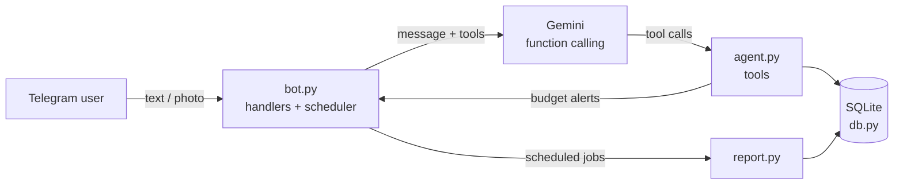

# Finance Buddy 💶

A personal finance AI agent that lives in Telegram. Tell it what you spent in plain language, send it a photo of a receipt, set monthly budgets, and get automatic weekly and monthly reports.

Built with **Python**, **Gemini function calling**, **SQLite** and **python-telegram-bot**. The bot talks to the user in Greek.

```
You:   8€ σούπερ μάρκετ και 2,20 καφές
Bot:   Καταχώρησα:
       - 8,00€ σε σούπερ μάρκετ
       - 2,20€ σε καφές

       ⚠️ Έφτασες στο 85% του budget για καφές: 25,50€ από 30,00€ (10/2026)
```

## Features

- **Natural-language logging**: "12€ σουβλάκια", "χθες 15 σινεμά". The agent picks the category and date, and splits messages with several expenses.
- **Questions about your spending**: "πόσα ξόδεψα σε καφέδες αυτόν τον μήνα;". Answers always come from the database, never invented by the model.
- **Receipt photos**: Gemini's multimodal input reads the total, store and date from a photo. If the total isn't legible, it saves nothing and asks.
- **Budgets with alerts**: monthly limits per category or overall. You get one alert when an expense crosses 80% of a limit and another when it goes over.
- **Scheduled reports**: every Sunday evening (last 7 days) and on the 1st of each month (previous month), each compared with the period before.
- **Plain commands**: `/add`, `/last`, `/summary`, `/budget`, `/report`, `/undo` work without the LLM.

## How it works



The agent exposes six tools to Gemini: `add_expense`, `spending_summary`, `recent_expenses`, `delete_last_expense`, `set_budget` and `budget_status`. The model decides which to call, and the SDK runs them automatically. Every number in a reply comes from a tool result.

### Design decisions

- **The LLM handles language, the code handles correctness.** Budget alerts and reports are computed by plain code, not generated by the model, so they are never dropped or miscalculated. Alerts are collected during tool calls and appended to the model's reply.
- **Tools validate their input.** They reject negative amounts, future dates and unknown categories, so a bad model output can't corrupt the data.
- **Minimal data to the LLM.** The model never sees the whole database, only the user's message and aggregated tool results.
- **Single-user by design.** The bot answers only the Telegram user ID in `ALLOWED_USER_ID` and silently ignores everyone else.
- **Send time, not processing time.** If the bot was offline, queued messages are processed later but saved with the time they were sent, in the configured timezone.

## Project structure

| File | Purpose |
|---|---|
| `bot.py` | Telegram handlers, access control, logging, scheduled jobs |
| `agent.py` | Gemini client, tool functions, system and receipt prompts |
| `db.py` | SQLite schema and queries, budget threshold logic |
| `report.py` | Weekly and monthly report formatting |
| `start_bot.bat` | Windows helper to run the bot in a console window |

## Setup

**Requirements:** Python 3.10+, a Telegram account, and a Gemini API key from [Google AI Studio](https://aistudio.google.com/apikey).

1. **Create a bot**: message [@BotFather](https://t.me/BotFather) on Telegram, send `/newbot`, and copy the token.

2. **Install**:
   ```bash
   git clone https://github.com/st-elliee/finance-buddy.git
   cd finance-buddy
   python -m venv venv
   source venv/bin/activate          # Windows: .\venv\Scripts\Activate.ps1
   pip install -r requirements.txt
   ```

3. **Configure**: copy `.env.example` to `.env` and fill in `TELEGRAM_TOKEN` and `GEMINI_API_KEY`.

4. **Run** `python bot.py` and send `/start` to your bot. It replies with your Telegram user ID. Put it in `.env` as `ALLOWED_USER_ID` and restart.

### Configuration

| Variable | Required | Description |
|---|---|---|
| `TELEGRAM_TOKEN` | yes | Bot token from @BotFather |
| `ALLOWED_USER_ID` | yes | Your Telegram user ID (the bot tells you on first `/start`) |
| `GEMINI_API_KEY` | no | Without it, only the plain commands work |
| `GEMINI_MODEL` | no | Defaults to `gemini-3.5-flash-lite` |
| `TIMEZONE` | no | IANA timezone for dates and reports, defaults to `Europe/Athens` |

### Running in the background on Windows

To start the bot silently at login, create a shortcut in the Startup folder (`Win + R`, then `shell:startup`) that points to `venv\Scripts\pythonw.exe` with argument `bot.py` and the project folder as "Start in". `pythonw` runs without a console window, and logs go to `bot.log`.

## Privacy

Expenses are stored locally in `finance.db`. Messages and receipt photos are sent to the Gemini API to be understood. On Gemini's free tier, Google may use submitted content to improve its products, so don't send anything you wouldn't want stored. `.env`, the database and the logs are excluded from Git.

## License

[MIT](LICENSE)
